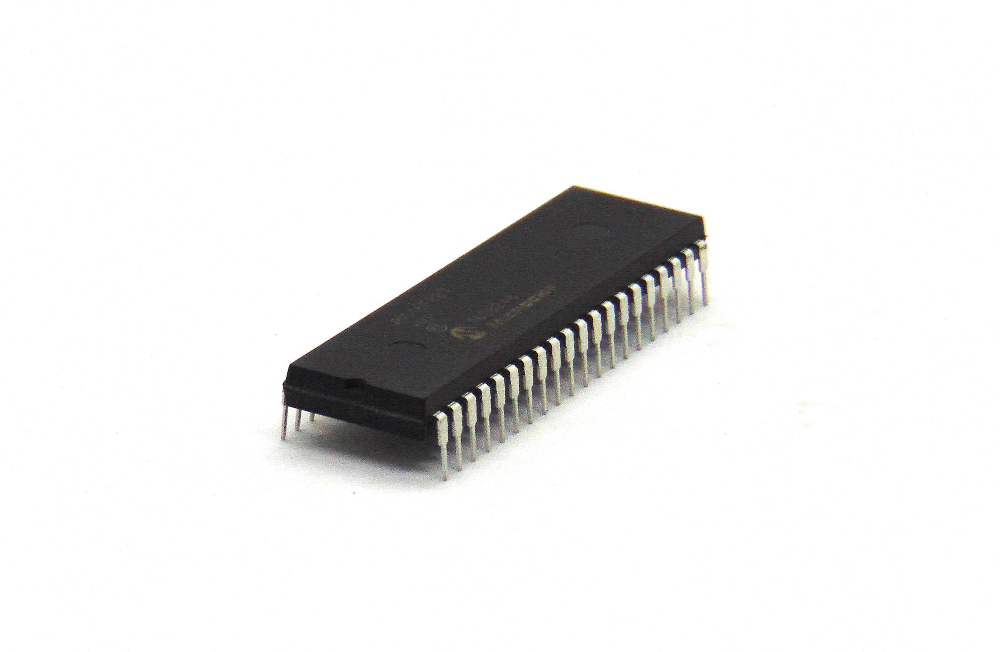
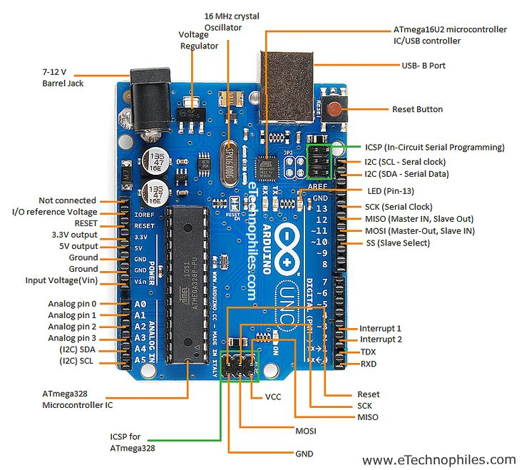
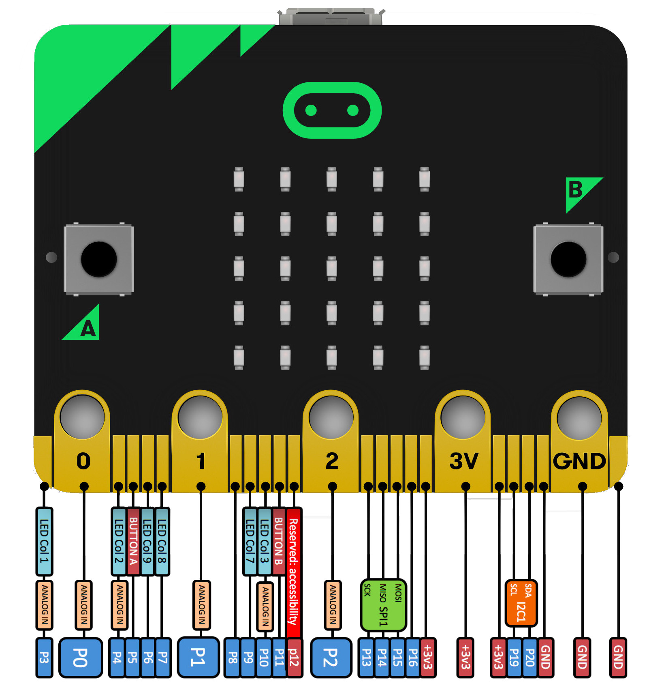
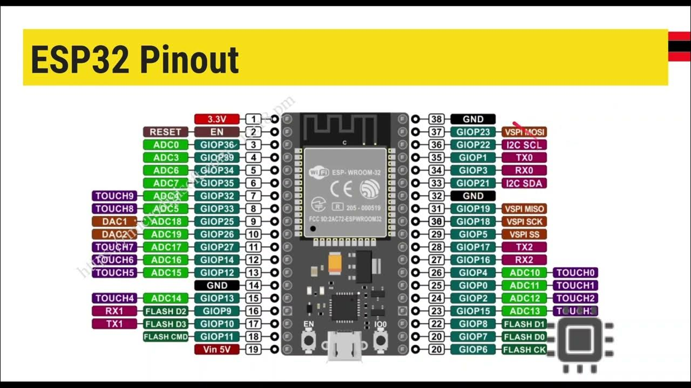

# Unidad 1 - Introducción a Microcontroladores

## Contenidos

---

### 🔹 ¿Qué es un Microcontrolador?

Un **microcontrolador** (MCU) es un sistema integrado en un solo chip que incluye:
- Microprocesador (unidad central de procesamiento - CPU),
- Memoria RAM y memoria de programa (Flash o ROM),
- Periféricos de entrada/salida (E/S),
- Convertidores analógico-digitales (ADC),
- Módulos de comunicación (UART, I2C, SPI).




#### Diferencias entre Microprocesador y Microcontrolador

| Característica         | Microprocesador                          | Microcontrolador                                |
|------------------------|------------------------------------------|-------------------------------------------------|
| Uso                    | Computadoras, notebooks                  | Dispositivos embebidos, robots, controladores  |
| Componentes integrados | Solo CPU                                 | CPU + RAM + ROM + E/S en el mismo chip         |
| Costo y consumo        | Mayor costo y consumo energético         | Económicos y de bajo consumo                    |
| Ejemplo                | Intel i5, AMD Ryzen                      | ATmega328P, ESP32, RP2040                      |

#### Analogía con una Computadora

| Computadora               | Microcontrolador               |
|---------------------------|--------------------------------|
| Microprocesador (CPU)     | Núcleo del microcontrolador    |
| RAM (memoria volátil)     | SRAM del microcontrolador      |
| Disco duro (almacenamiento)| Memoria Flash/ROM (programa)   |
| Puertos USB, HDMI         | Pines de Entrada/Salida (GPIO) |


### FILMINAS DE CLASE

[Haz clic aquí](https://docs.google.com/presentation/d/1te1SaxrvbbyhmZEmACSJcM5sy9s_Wb2xWDlSsGxgXgQ/edit?usp=sharing)


---

### 🔹 Arduino UNO: Componentes y Puertos
- Microcontrolador **ATmega328P** de **8 bits**.
- 14 pines digitales (0-13), algunos con **PWM (~)**.
- 6 pines analógicos (A0-A5).
- Memoria:
  - Flash: 32 KB (programa)
  - SRAM: 2 KB (RAM)
  - EEPROM: 1 KB (datos permanentes)
- Alimentación: 5V, 3.3V, GND.
- Comunicación: USB-B.



---

### 🔹 Micro:bit: Componentes y Puertos
- Microcontrolador **nRF51822** o **nRF52833** de **32 bits** (según versión).
- Matriz LED 5x5.
- 2 botones (A y B).
- Sensores: acelerómetro, temperatura, brújula.
- Comunicación: Bluetooth, USB.
- GPIOs accesibles mediante edge connector.
- Memoria:
  - Flash: 256 KB
  - RAM: 16 KB



---

### 🔹 Raspberry Pi Pico y ESP32

#### Raspberry Pi Pico
- Microcontrolador **RP2040** de **32 bits** (doble núcleo ARM Cortex-M0+).
- 264 KB de SRAM.
- 2 MB de Flash externa.
- 26 GPIOs (algunos con funciones analógicas).
- Velocidad: 133 MHz.
- Bajo costo, alta versatilidad.


#### ESP32
- Microcontrolador **Xtensa LX6** de **32 bits** (doble núcleo).
- RAM: hasta 520 KB interna + externa opcional.
- Flash: entre 4 MB y 16 MB (según módulo).
- Wi-Fi + Bluetooth integrados.
- Varios ADC, DAC y sensores.
- Ideal para IoT.



---

### 🔹 IDEs (Entornos de Desarrollo)
- **Arduino IDE**: clásico, usa C/C++.
- **Thonny**: ideal para MicroPython, usado con Pico o ESP32.
- **MakeCode**: para bloques en micro:bit.
- **Tinkercad Circuits**: simulación en bloques y código.

---

### 🔹 Primer Programa: "Hola Mundo" en Microcontroladores

#### En C (Arduino)
```c
void setup() {
  pinMode(13, OUTPUT);  // Configura el pin 13 como salida
}

void loop() {
  digitalWrite(13, HIGH); // Enciende el LED
  delay(1000);            // Espera 1 segundo
  digitalWrite(13, LOW);  // Apaga el LED
  delay(1000);            // Espera 1 segundo
}
