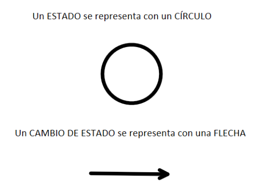
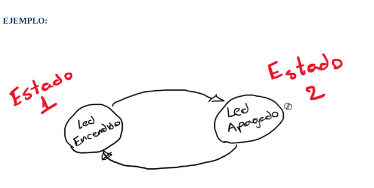
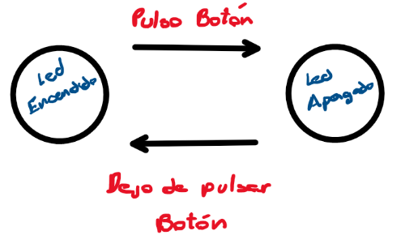
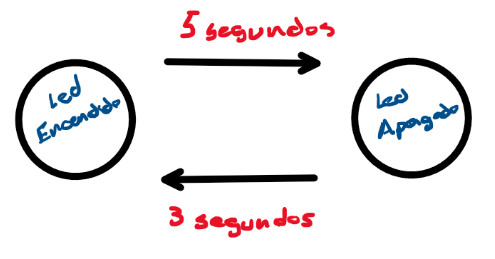
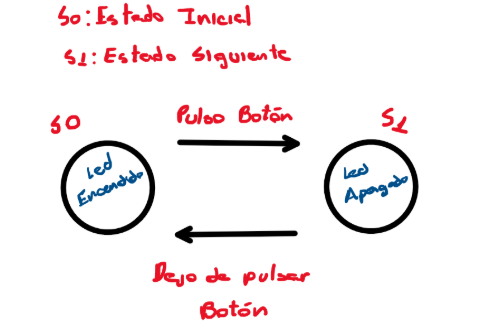
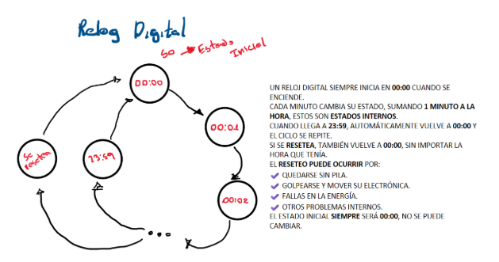

#  Máquina de Estados

---

## ¿Qué es una Máquina de Estados?

Una **máquina de estados finitos (FSM - Finite State Machine)** es un modelo matemático que representa un sistema que puede encontrarse en un conjunto **finito de estados** y cambiar entre ellos en respuesta a ciertas **entradas**. Se utiliza en electrónica y programación para diseñar **sistemas de control secuencial**.

###  Componentes de una FSM

1. **Estados**: Conjunto de situaciones posibles en las que puede estar el sistema.
2. **Transiciones**: Cómo se pasa de un estado a otro según las entradas.
3. **Salidas**: Lo que el sistema hace en cada estado.

Las FSM son fundamentales en electrónica digital para modelar sistemas como:
- Semáforos 🚦
- Robots 🤖
- Protocolos de comunicación 📡

---

##  ¿Qué nos interesa?

No nos enfocamos en el modelo matemático, sino en **entender el comportamiento de nuestros proyectos**.

Antes de conectar componentes (LEDs, motores, sensores), lo fundamental es **saber qué debe hacer el sistema**. Para eso, comenzamos con **dibujos de estados y transiciones**.





---

## ⚙️ ¿Qué son los eventos internos o externos?

- **Evento externo**: Algo que sucede fuera del sistema, por ejemplo, **presionar un botón**.




- **Evento interno**: Algo que sucede **dentro del sistema**, como una **variable que cambia automáticamente** o un **temporizador que finaliza**.



---

## 🔰 ¿Cuál es el estado inicial?

El **estado inicial** se suele llamar `S0`.

Se define al comenzar el sistema, y puede depender:
- De un evento externo.
- De una condición inicial predefinida.

📌 *Ejemplo: LED PRENDIDO o APAGADO al iniciar.*  
Podemos decidir nosotros con qué estado comienza el programa.




Hay casos donde el estado inicial `S0`es siempre "el mismo", podemos mencionar un pequeño ejemplo con un Relog Digital




---

## 🔧 PRÁCTICO

**Objetivo:** Prender y apagar un LED con un botón usando Arduino UNO en **Tinkercad**, realizando antes el diagrama de Maquinas de Estados.

### 🧰 Componentes necesarios

- 2 resistencias de 220 ohms
- 1 pulsador
- 1 LED
- 1 protoboard
- 1 placa Arduino UNO

### 🧱 Bloques a usar en Tinkercad

- Pin digital 7 como entrada (**color morado**)
- Bloque de control **SI-SINO**
- Bloque matemático con operador igual (**color verde**)
- Bloques de salida al pin digital 2 (**color azul**)

## 🔌 Teórico: Resistencias Pull-Up y Pull-Down

En electrónica digital, los **pines de entrada** de un microcontrolador (como Arduino) pueden quedar en un estado **"flotante"** si no están conectados directamente a un voltaje definido. Esto puede provocar lecturas erráticas o inestables.

Para evitar esto, se usan resistencias **pull-up** o **pull-down**.

---

###  Pull-Up

- Conectan el pin de entrada al voltaje **Vcc (5V)** mediante una **resistencia**.
- El pin se mantiene en estado **ALTO (HIGH)** mientras no haya acción externa.
- Si se conecta a masa mediante un botón, el pin pasa a **BAJO (LOW)**.

```text
+5V ───┬──┐
       │  │
      [R] |
       │  │
      Pin ──────> hacia Arduino
       │
      Botón
       │
      GND
```
### Pull-Down
- Conectan el pin de entrada a GND mediante una resistencia.

- El pin se mantiene en estado BAJO (LOW) mientras no se presione el botón.

- Si el botón se conecta a 5V, el pin pasa a ALTO (HIGH).
```

GND ───┬──┐
       │  │
      [R] |
       │  │
      Pin ──────> hacia Arduino
       │
      Botón
       │
      +5V

```

### Valores típicos
- Generalmente se utilizan resistencias de 10kΩ para pull-up o pull-down.

- En algunos casos también puede usarse 1kΩ a 4.7kΩ si se necesita mayor corriente.

### En Arduino

- Arduino tiene resistencias pull-up internas que se pueden activar con código:

```c++
pinMode(7, INPUT_PULLUP);  // Activa la resistencia pull-up interna del pin 7
```

### Conclusión
- Las resistencias pull-up y pull-down definen un estado lógico claro cuando no hay señal.

- Son fundamentales para trabajar con botones, sensores y entradas digitales en general.


---

## 💡 SOLUCIÓN

Haz clic en el enlace para ver la solución:

🔗 [Ver solución en Tinkercad](https://www.tinkercad.com/things/0FHGwyQzwQu/editel?returnTo=%2Fdashboard&sharecode=ZCAzwbm5mS52utbiefpkfQ4CJ7QwmaHhQGL923SioJs)


---
