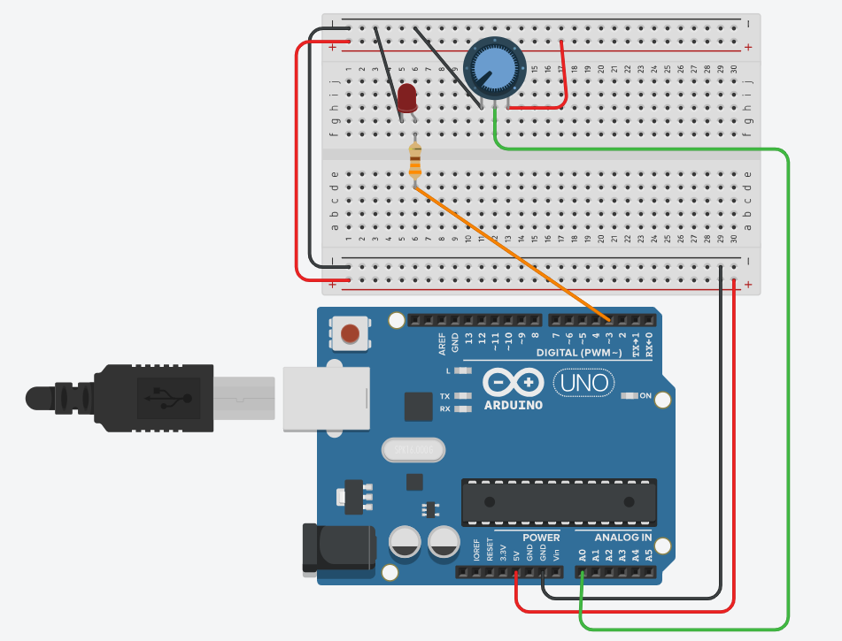

# 🎚️ Unidad 5 - Manejo de Señales Analógicas (con Bloques)

## 🎯 Objetivo

- Comprender cómo los microcontroladores pueden leer y generar señales analógicas.
- Aplicar estos conceptos utilizando programación por bloques en Tinkercad.

---

## 1. Introducción a las Señales Analógicas

### 🔸 ¿Qué es una señal analógica?

Una **señal analógica** es una señal continua que puede tener **infinitos valores posibles** dentro de un rango. A diferencia de una señal digital (que es encendido o apagado), la analógica **varía gradualmente**.

📊 *Ejemplo: El voltaje que entrega un potenciómetro varía de 0V a 5V según su posición.*

---

### 🔸 Diferencias entre señales digitales y analógicas

| Característica       | Señal Digital         | Señal Analógica            |
|----------------------|-----------------------|----------------------------|
| Valores posibles     | 0 o 1 (LOW o HIGH)    | Cualquier valor entre 0 y 1023 (en Arduino) |
| Ejemplo              | Encender/apagar LED   | Controlar el brillo de un LED con potenciómetro |

---

### 🔸 Muestreo y resolución

- **Muestreo**: es la frecuencia con la que se toma el valor de la señal analógica.
- **Resolución**: es cuántos valores distintos puede representar el ADC (en Arduino, es de **10 bits**, es decir, de 0 a 1023).

---

## 2. Lectura de Señales Analógicas - El ADC

### 🔹 ¿Qué es un ADC?

El **ADC (Conversor Analógico-Digital)** convierte señales analógicas (voltajes) en valores numéricos que el microcontrolador puede interpretar.

📌 En Tinkercad, el pin **A0** se usa para leer el valor de un **potenciómetro**.

---

### 🧪 Ejemplo práctico (bloques)

[LINK DE TINKERCAD](https://www.tinkercad.com/things/idxjZ504puV/editel?returnTo=%2Fdashboard%2Fcollections%2F9Th4JMdooGd%2Fcircuits&sharecode=jSWWQ-m40zdSDF2N_PhVNF5bIrrPxwRh-Xqwgo4gNVM)

> Leer el valor de un potenciómetro y mostrarlo en el monitor serial.

```text
por siempre:
    establecer variable "valor" a leer valor analógico del pin A0
    escribir en el monitor serie "Valor leído: "
    escribir en el monitor serie variable "valor"
    esperar 500 milisegundos
```

---

## 3. Generación de Señales Analógicas - PWM

### 🔹 ¿Qué es PWM?

**PWM (Modulación por Ancho de Pulso)** es una técnica para **simular una señal analógica usando una señal digital** que se enciende y apaga muy rápido.

🕹️ **Ejemplo de uso**: variar el **brillo de un LED** según el valor leído de un potenciómetro.

!

---

### 🧪 Ejemplo práctico (bloques)

[LINK TINKERCAD](https://www.tinkercad.com/things/eouU8vep38B/editel?sharecode=ZqScrUCsDd1g0v7epqKwdn6sq6JW857nXXmFYy8qLe0)

> Usar el valor del potenciómetro para modificar el brillo de un LED (PWM).

```text
por siempre:
    establecer variable "valor" a leer valor analógico del pin A0
    escribir valor analógico en pin 9 con variable "valor"
```

---

## 4. Señales Analógicas en Programación por Bloques

- En Tinkercad, podés **leer señales analógicas** con bloques de entrada del tipo:
  - `leer valor analógico del pin A0`
- Y podés **escribir valores analógicos** con:
  - `escribir valor analógico en pin X`

🎮 También podés controlar **servomotores**, donde el ángulo puede depender del valor leído.

---

### 🧪 Ejemplo extra: Servomotor controlado por potenciómetro

```text
por siempre:
    establecer variable "valor" a leer valor analógico del pin A0
    establecer ángulo del servo conectado al pin 10 a variable "valor"
```

---

## ✅ TAREA PRÁCTICA

1. Crear un circuito con:
   - 1 potenciómetro conectado a **A0**
   - 1 LED conectado al **pin 9** (PWM)
2. Usar bloques para que el LED cambie de **brillo** según la posición del potenciómetro.
3. Luego, reemplazar el LED por un **servomotor** y hacer que el ángulo varíe con el potenciómetro.
4. Tomar capturas del circuito y del código en bloques.
5. Escribir una reflexión: ¿Qué diferencias viste entre el control digital (encendido/apagado) y el analógico (variación de valores)?

---

##  Conclusión

El manejo de señales analógicas nos permite **interpretar el mundo real** de manera más precisa. En programación por bloques, estas señales se usan fácilmente con potenciómetros, sensores y actuadores como LEDs y servos, abriendo la puerta a proyectos más interactivos.

---